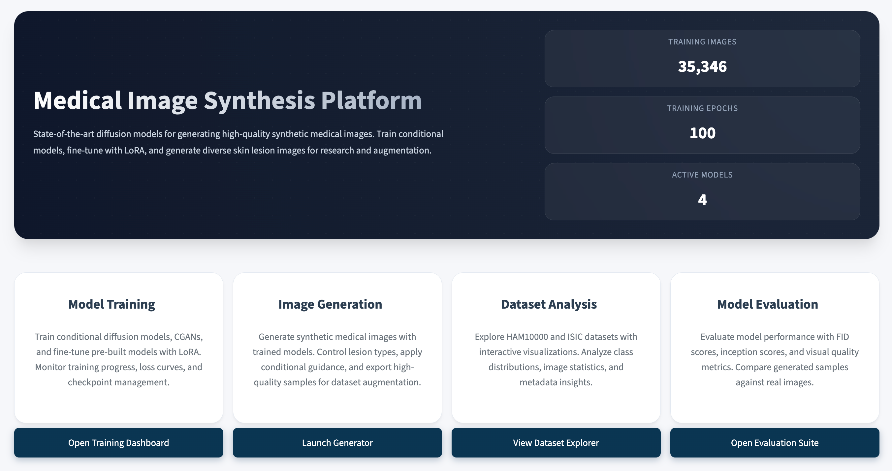
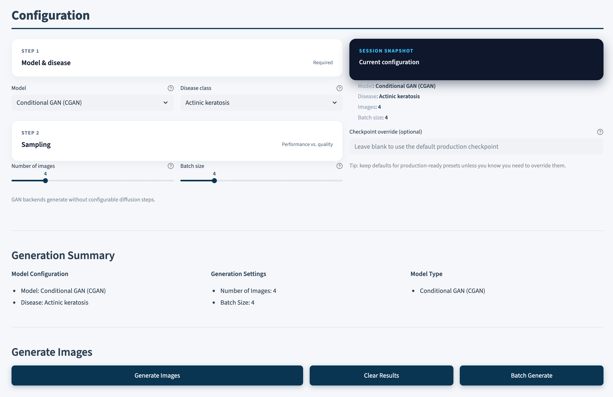
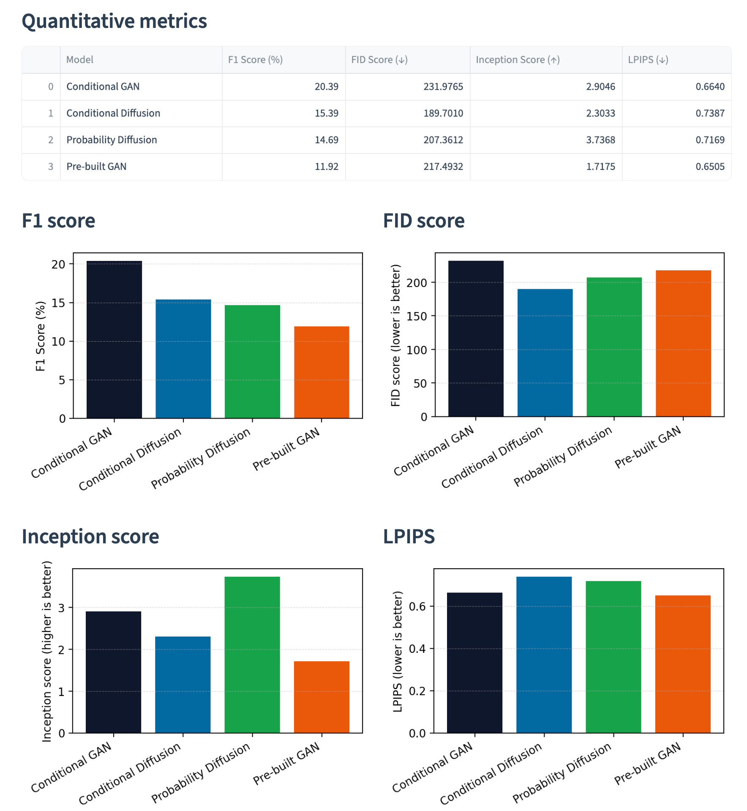

# Skin Lesion Generation with GANs and Diffusion Models

Generate synthetic dermoscopic images using 4 different generative models trained on HAM10000 and ISIC datasets.

## Tech Stack

[](https://www.python.org/downloads/release/python-3120/)
[](https://pytorch.org/)
[](https://huggingface.co/docs/diffusers/index)
[](https://streamlit.io/)
[](https://fastapi.tiangolo.com/)
[](https://www.docker.com/)
[](https://wandb.ai/)
[](https://en.wikipedia.org/wiki/Diffusion_model)
[](https://arxiv.org/abs/2106.09685)

## 🎯 Available Models

| Model | Type | Best For | Training Time |
|-------|------|----------|---------------|
| **CGAN** | Conditional GAN | Fast training, good quality | ~2-3 hours |
| **Conditional Diffusion** | Custom Diffusion | High quality, flexible | ~6-8 hours |
| **Prebuilt GAN** | StyleGAN-based | Fine-tuning, transfer learning | ~4-6 hours |
| **Prebuilt Diffusion** | Stable Diffusion | Best quality, memory efficient | ~8-12 hours |


## UI Screenshots

### Home Page


### Generation Page


### Evaluation



## 📚 Full Documentation

**[Complete Project Documentation](https://docs.google.com/document/d/14nC9hbQKUlsImFxmFWOYz6TunfiWvMNqzaboft5dPyE/edit?tab=t.wsanzcdhkh2h)** - Methodology, architecture details, and results


## 🚀 Quick Start

### 1. Setup Environment

```bash
# Clone repository
git clone https://github.com/mrakelinggar/apan5560-project.git
cd apan5560-project

# Create virtual environment (recommended: uv)
curl -LsSf https://astral.sh/uv/install.sh | sh
uv venv && source .venv/bin/activate
uv sync

# Alternative: using pip
python -m venv venv
source venv/bin/activate  # Windows: venv\Scripts\activate
pip install -e .
```

### 2. Download Dataset

```bash
# Automatic download (recommended)
python download_dataset.py "1KCjAyv1vjB1p92YcMS1rfTcXzFFc4LT0"

# Or manual: https://drive.google.com/file/d/1DmJEVpWF8iLaiF5_ET1G8HRYzhh5tSAD/view
```

### 3. Check Your GPU

```bash
python device_utils.py  # Auto-detects CUDA/MPS/CPU
```

---

## 🎓 Training Models

### CGAN (Fastest - Good for Testing)

```bash
python train/train_cgan.py \
    --ham_csv dataset/HAM10000_metadata.csv \
    --ham_img_dir dataset/HAM10000_images \
    --bcn_csv dataset/ISIC_metadata.csv \
    --bcn_img_dir dataset/ISIC_images \
    --batch_size 64 \
    --epochs 50 \
    --img_size 64
```

**Key Parameters:**
- `--img_size`: 32, 64, or 128 (default: 64)
- `--batch_size`: 64 (default)
- `--epochs`: 50+ recommended
- `--amp`: Enable mixed precision (CUDA only)

### Conditional Diffusion (High Quality)

```bash
python train/train_diffusion.py \
    --ham_csv dataset/HAM10000_metadata.csv \
    --ham_img_dir dataset/HAM10000_images \
    --bcn_csv dataset/ISIC_metadata.csv \
    --bcn_img_dir dataset/ISIC_images \
    --batch_size 4 \
    --epochs 100 \
    --img_size 256 \
    --use_lora \
    --amp
```

**Key Parameters:**
- `--img_size`: 128, 256, or 512 (default: 256)
- `--batch_size`: 4-8 recommended (default: 32)
- `--num_timesteps`: 500-1000 (default: 500, higher = better quality)
- `--use_lora`: Enable efficient fine-tuning (recommended)
- `--amp`: Mixed precision for NVIDIA GPUs

### Prebuilt GAN (Transfer Learning)

```bash
python train/train_prebuilt_gan.py \
    --ham_csv dataset/HAM10000_metadata.csv \
    --ham_img_dir dataset/HAM10000_images \
    --bcn_csv dataset/ISIC_metadata.csv \
    --bcn_img_dir dataset/ISIC_images \
    --batch_size 16 \
    --epochs 100 \
    --img_size 128
```

**Key Parameters:**
- `--img_size`: 128 or 256 (default: 128)
- `--batch_size`: 16 recommended (default: 16)
- `--epochs`: 100+ recommended

⚠️ **Important:** Use the same `img_size` for training and generation! Provided checkpoint uses 128.

### Prebuilt Diffusion (Best Quality, Stable Diffusion-based)

```bash
python train/train_probability_diffusion.py \
    --ham_csv dataset/HAM10000_metadata.csv \
    --ham_img_dir dataset/HAM10000_images \
    --bcn_csv dataset/ISIC_metadata.csv \
    --bcn_img_dir dataset/ISIC_images \
    --batch_size 8 \
    --epochs 100 \
    --img_size 128 \
    --use_lora \
    --amp
```

**Key Parameters:**
- `--img_size`: Must be multiple of 8 (128, 256, 512)
- `--batch_size`: 4-8 recommended due to memory requirements
- `--use_lora`: Highly recommended for memory efficiency
- Uses pre-trained Stable Diffusion v1.4 (downloads automatically)

**Dataset Configuration:**
- **Unified Data Loader**: All models use the same data loading interface
- **HAM10000 + BCN20000**: Combined datasets with standardized labels
- **Automatic Image Resizing**: All images are automatically resized to square `img_size × img_size` regardless of original resolution
- **No Data Augmentation**: Uses original images without any augmentation for clean training
- **No Class Balancing**: Uses all original images from each class without sampling or capping
- **Stratified Splits**: 70% train, 15% validation, 15% test
- **Class Filtering**: Optional `--top_n_classes` to filter to top N classes (can be added to data loader)

**Training Features:**
- **Automatic Device Detection**: Automatically detects and uses MPS (Mac), CUDA (NVIDIA), or CPU
- **Progress Bars**: Real-time training progress with `tqdm` showing loss metrics
- **Model-Specific Checkpoints**: Each model saves to its own directory
- **Final Model Saving**: Automatically saves final trained models as `<model>_final.pt` for easy loading
- **Training Summaries**: Saves comprehensive training summaries as `training_summary.json` with final losses, epochs, and model configs
- **Output Organization**: Generated samples saved to `output/<model_name>/`
- **LoRA Support**: Efficient fine-tuning for diffusion models (Conditional Diffusion and Prebuilt Diffusion)
- **Adaptive Dataloading**: Auto-tuned workers, pinned memory, and optional AMP for CUDA pipelines
- **Auto Dataset Download**: All training scripts automatically download dataset if missing
- **Error Handling**: Robust image loading with fallback for corrupted images

**Checkpoint & Output Directories:** See "Project Structure" section below for directory organization.

### 7. Generate Images

After training, generate synthetic skin lesion images using the final trained models:

#### Generate with Conditional GAN
```bash
python generate/generate_cgan.py \
    --checkpoint checkpoints/cgan/cgan{img_size}_final.pt \
    --num_samples 8 \
    --include_real \
    --output output/cgan/cgan_generated.png
```

**Generation Parameters:**
- `--checkpoint`: Path to trained model checkpoint
- `--num_samples`: Number of generated samples per class (default: 8)
- `--include_real`: Include one real image per class for comparison
- `--output`: Output path for generated grid
- `--ham_csv`, `--ham_img_dir`, `--bcn_csv`, `--bcn_img_dir`: Dataset paths (for real image loading)

#### Generate with Conditional Diffusion
```bash
python generate/generate_diffusion.py \
    --checkpoint checkpoints/conditional_diffusion/diffusion_final.pt \
    --class_id 0 \
    --num_samples 4 \
    --output output/conditional_diffusion/diffusion_generated.png
```

#### Generate with Prebuilt GAN
```bash
python generate/generate_prebuilt_gan.py \
    --checkpoint checkpoints/prebuilt_gan/G_final.pt \
    --num_classes 3 \
    --img_size 128 \
    --samples_per_class 4 \
    --output output/prebuilt_gan/prebuilt_gan_generated.png
```

**Important:** The `img_size` parameter must match the size used during training. The provided checkpoint (`G_final.pt`) was trained with `img_size=128`. Using a different size will cause a model architecture mismatch error.

#### Generate with Prebuilt Diffusion
```bash
python generate/generate_pb_diffusion.py \
  --checkpoint checkpoints/probability_diffusion/prebuilt_diffusion_epoch_88_final.pt \
  --num_classes 3 \
  --class_id 0 \
  --num_samples 4 \
  --output output/probability_diffusion
```

### 8. Check GPU Acceleration

The project includes an automatic device detection utility that checks for CUDA (NVIDIA), MPS (Apple Silicon), or CPU:

```bash
# Automatic device detection (recommended)
python device_utils.py
```

This will automatically:
- **Detect NVIDIA GPUs** via `nvidia-smi` and PyTorch CUDA
- **Detect Apple Silicon GPUs** (M1/M2/M3) via MPS
- **Fallback to CPU** if no GPU is available
- **Display detailed information** about available devices
- **Test device functionality** with a simple tensor operation

**Output includes:**
- System information (platform, processor, Python, PyTorch versions)
- NVIDIA GPU details (if available via nvidia-smi)
- CUDA availability and GPU information (if available in PyTorch)
- MPS availability (for Apple Silicon)
- CPU information
- Recommended device for training

**Alternative manual checks:**
```bash
# Quick CUDA check
python -c "import torch; print(f'CUDA available: {torch.cuda.is_available()}')"

# Quick MPS check (Mac)
python -c "import torch; print(f'MPS available: {torch.backends.mps.is_available() if hasattr(torch.backends, \"mps\") else False}')"

# Check device count
python -c "import torch; print(f'CUDA devices: {torch.cuda.device_count() if torch.cuda.is_available() else 0}')"
```

### 9. Intel PC GPU Setup (Optional)

**If you have an NVIDIA GPU but CUDA isn't working:**

1. **Install NVIDIA Drivers:**
   ```bash
   # Windows: Download from nvidia.com/drivers
   # Linux: Use your package manager
   sudo apt update && sudo apt install nvidia-driver-535  # Ubuntu example
   ```

2. **Install CUDA-enabled PyTorch:**
   ```bash
   # Uninstall CPU-only version first
   pip uninstall torch torchvision torchaudio
   
   # Install CUDA version
   pip install torch torchvision torchaudio --index-url https://download.pytorch.org/whl/cu118
   ```

3. **Verify Installation:**
   ```bash
   nvidia-smi  # Should show your GPU
   python intel_utils.py  # Should detect CUDA
   ```

## System Requirements

### Minimum Requirements
- **Python**: 3.12 or higher
- **RAM**: 8GB (16GB recommended)
- **Storage**: 10GB free space
- **OS**: macOS 10.15+, Windows 10+, or Linux

### Recommended for Training
- **Mac**: M1/M2/M3 with 16GB+ unified memory
- **Intel PC**: NVIDIA RTX 3070/4060 or better (8GB+ VRAM)
- **AMD PC**: NVIDIA GPU recommended (AMD ROCm support experimental)
- **RAM**: 32GB for large datasets
- **Storage**: SSD with 50GB+ free space

### GPU Requirements by Platform
| Platform | GPU | VRAM | Performance |
|----------|-----|------|-------------|
| Mac M1/M2/M3 | Integrated | 16GB+ | Excellent with MPS |
| Intel + NVIDIA | RTX 3060+ | 8GB+ | Excellent with CUDA |
| Intel + AMD | RX 6600+ | 8GB+ | Limited (CPU fallback) |
| Intel iGPU | Intel Xe | N/A | CPU only |

## Dependencies Overview

Our project includes comprehensive packages for:

### **Core Data Science**
- `numpy`, `pandas`, `matplotlib`, `seaborn`, `scikit-learn`
- `jupyter`, `ipykernel` for interactive development

### **Deep Learning & Computer Vision**
- `torch`, `torchvision`, `torchaudio` - PyTorch ecosystem
- `transformers`, `diffusers` - Hugging Face models
- `timm` - Pre-trained vision models
- `pytorch-lightning` - High-level training framework

### **Image Processing**
- `opencv-python` - Computer vision operations
- `pillow`, `imageio`, `scikit-image` - Image manipulation
- `albumentations` - Advanced data augmentation

### **Performance & GPU Acceleration**
- `accelerate` - Distributed training and mixed precision
- `xformers` - Memory-efficient transformers
- `safetensors` - Safe model serialization

### **Experiment Tracking & Visualization**
- `wandb` - Experiment tracking and collaboration
- `tensorboard` - Training visualization
- `tqdm` - Progress bars

## Project Structure

```
apan5560-project/
├── Root Files
│   ├── README.md
│   ├── pyproject.toml
│   ├── uv.lock
│   ├── docker-compose.yml
│   ├── .env
│   ├── .gitignore
│   ├── .python-version
│   ├── dataset.py                    # Legacy dataset utilities
│   ├── main.py
│   ├── main (archive).py
│   ├── download_dataset.py
│   ├── download_models.py
│   ├── example_download.py
│   ├── generate_samples.py
│   ├── generate_batch_evaluation.py
│   ├── device_utils.py                # CUDA/MPS/CPU detection
│   ├── mps_utils.py                   # Apple Silicon utilities
│   ├── intel_utils.py                 # Intel PC utilities
│   ├── training_config.py
│   ├── train_diffusion.py
│   ├── diagnose_model.py
│   ├── debug_diffusers.py
│   ├── fix_macos_mutex.sh
│   └── GENERATED_IMAGES_ORGANIZATION.md
│
├── Data & Notebooks
│   ├── dataset/                       # HAM10000 + ISIC datasets
│   │   ├── HAM10000_metadata.csv
│   │   ├── HAM10000_images/
│   │   ├── HAM10000_segmentations_lesion_tschandl/
│   │   ├── ISIC_metadata.csv
│   │   ├── ISIC_images/
│   │   ├── ISIC2018_Task3_Test_Images/
│   │   ├── Test/
│   │   └── readme.txt
│   ├── Train Test Val.ipynb
│   ├── Train Test Val (Top 3).ipynb
│   ├── Exploration/
│   │   └── Metadata Explorer.ipynb
│   └── mockups/
│
├── Data Loading
│   └── data/                          # Unified data loader
│       ├── __init__.py
│       ├── data_loader.py             # HAM10000 + BCN20000
│       ├── dataset.py
│       └── dataset_utils.py
│
├── Models
│   └── models/                        # Model architectures
│       ├── __init__.py
│       ├── cgan.py
│       ├── conditional_diffusion.py   # With LoRA support
│       ├── ConditionalDiffusion.md
│       ├── prebuilt_gan.py
│       ├── prebuilt_diffusion.py      # Stable Diffusion
│       ├── data_loader.py
│       ├── dataset.py
│       ├── generate.py
│       ├── model.py
│       └── train_diffusion.py
│
├── Training
│   └── train/
│       ├── __init__.py
│       ├── train_cgan.py
│       ├── train_diffusion.py
│       ├── train_prebuilt_gan.py
│       ├── train_prebuilt_diffusion.py
│       ├── train_probability_diffusion.py
│       └── finetune_diffusion.py
│
├── Generation
│   └── generate/
│       ├── __init__.py
│       ├── generate_all.py
│       ├── generate_cgan.py
│       ├── generate_cgan_prod.py
│       ├── generate_diffusion.py
│       ├── generate_diffusion_prod.py
│       ├── generate_prebuilt_gan.py
│       ├── generate_prebuilt_gan_prod.py
│       ├── generate_prebuilt_diffusion.py
│       ├── generate_prebuilt_diffusion_prod.py
│       ├── generate_pb_diffusion.py
│       └── generate_probability_diffusion.py
│
├── Evaluation
│   └── evaluation/
│       ├── cnn_classifier.py
│       └── evaluate_generated.py
│
├── Checkpoints & Output
│   ├── checkpoints/                   # Model checkpoints
│   │   ├── prebuilt_diffusion_epoch_88_final.pt
│   │   ├── cgan/
│   │   ├── conditional_diffusion/
│   │   ├── prebuilt_diffusion/
│   │   ├── prebuilt_gan/
│   │   └── Test/
│   ├── output/                        # Generated samples
│   │   ├── cgan/
│   │   ├── conditional_diffusion/
│   │   ├── prebuilt_gan/
│   │   ├── probability_diffusion/
│   │   └── evaluation_images/
│   ├── lora_weights/                  # LoRA adapters
│   │   ├── adapter_config.json
│   │   ├── adapter_model.safetensors
│   │   └── README.md
│   ├── samples/
│   ├── results/
│   └── temp/
│
├── Logs & Monitoring
│   ├── logs/                          # Training logs
│   │   ├── cnn_evaluator_*/
│   │   └── eval/
│   └── log_eval/                      # Evaluation logs
│       ├── cgan/
│       ├── conditional_diffusion/
│       ├── prebuilt_diffusion/
│       └── prebuilt_gan/
│
├── API Service
│   └── api/                           # FastAPI service
│       ├── main.py
│       ├── Dockerfile
│       ├── start.sh
│       ├── pyproject.toml
│       ├── README.md
│       ├── download_dataset.py
│       ├── download_models.py
│       ├── routers/                   # API endpoints
│       │   ├── __init__.py
│       │   ├── embedding.py
│       │   ├── neural_networks.py
│       │   └── probability.py
│       ├── commands/                  # CLI commands
│       │   ├── train_cnn.py
│       │   ├── train_diffusion.py
│       │   ├── train_energy.py
│       │   └── train_gan.py
│       ├── help_lib/                  # Helper utilities
│       │   ├── __init__.py
│       │   ├── checkpoints.py
│       │   ├── data_loader.py
│       │   ├── embeddings.py
│       │   ├── evaluator.py
│       │   ├── generator.py
│       │   ├── model.py
│       │   ├── neural_networks.py
│       │   ├── probability.py
│       │   ├── text_processing.py
│       │   ├── trainer.py
│       │   └── utils.py
│       ├── models/                    # API models
│       │   ├── __init__.py
│       │   ├── bigram_model.py
│       │   ├── cnn_models.py
│       │   ├── energy_diffusion_models.py
│       │   ├── gan_models.py
│       │   ├── requests.py
│       │   └── responses.py
│       ├── checkpoints/               # API checkpoints
│       │   ├── cnn/
│       │   ├── cnn_cifar/
│       │   ├── cnn_cifar10/
│       │   ├── diffusion_cifar/
│       │   ├── energy_cifar/
│       │   ├── gan/
│       │   └── gan_mnist/
│       ├── dataset/
│       ├── data/                     # CIFAR-10, MNIST
│       ├── generate/
│       ├── lora_weights/
│       ├── outputs/
│       └── results/
│
├── Streamlit App
│   └── app-streamlit/                 # Web interface
│       ├── Home.py
│       ├── Dockerfile
│       ├── requirements.txt
│       ├── requirements-dev.txt
│       ├── README.md
│       ├── README_GENERATION.md
│       ├── localazy.example.json
│       ├── utils.py
│       ├── pages/
│       │   ├── 0_Dataset_Analysis.py
│       │   ├── 1_Training.py
│       │   ├── 2_Image_Generation.py
│       │   └── 4_Evaluation.py
│       ├── components/
│       │   ├── __init__.py
│       │   ├── card.py
│       │   ├── footer.py
│       │   └── header.py
│       ├── functions/
│       │   ├── __init__.py
│       │   ├── components.py
│       │   ├── database.py
│       │   ├── eda_components.py
│       │   ├── menu.py
│       │   ├── model_utils.py
│       │   ├── readme.md
│       │   └── visualization.py
│       ├── styles/
│       │   └── app.css
│       ├── locales/                  # Translations (de, pl)
│       │   ├── base.pot
│       │   ├── de/LC_MESSAGES/base.po
│       │   └── pl/LC_MESSAGES/base.po
│       ├── images/
│       ├── data/
│       │   ├── summary.csv
│       │   └── summary.json
│       ├── temp/
│       └── backup/
│
└── Cache & Python
    ├── __pycache__/
    ├── .venv/                        # Virtual environment
    └── .uv/                          # UV cache
```

## Usage Examples

### Using the Unified Data Loader
```python
from data.data_loader import create_data_loaders

# Load data for any model
train_loader, val_loader, test_loader, disease_classes = create_data_loaders(
    ham_metadata_path="dataset/HAM10000_metadata.csv",
    ham_img_dir="dataset/HAM10000_images",
    bcn_metadata_path="dataset/ISIC_metadata.csv",
    bcn_img_dir="dataset/ISIC_images",
    batch_size=32,
    img_size=256,  # Images will be resized to 256×256 square
    top_n_classes=3,  # Optional: filter to top N classes
    seed=42
)
```

**Data Loader Features:** See "Dataset Configuration" section above for details.

### Using Models
```python
from models import (
    Generator, Discriminator,  # Conditional GAN
    ConditionalDiffusionModel,  # Conditional Diffusion
    ConditionalGenerator, ConditionalDiscriminator,  # Prebuilt GAN
    DiffusionModel  # Prebuilt Diffusion
)

# Example 1: Create Conditional Diffusion Model with LoRA
model = ConditionalDiffusionModel(
    image_size=256,
    num_classes=3,
    use_lora=True,  # Enable LoRA
    lora_r=4,
    lora_alpha=16,
    lora_dropout=0.1
)

# Example 2: Create Prebuilt Diffusion Model with LoRA
model = DiffusionModel(
    num_classes=3,
    use_lora=True  # Enable LoRA (config is hardcoded in model)
)
```

### Download Dataset Programmatically
```python
from example_download import download_dataset

# Download with Google Drive URL
success = download_dataset(
    "https://drive.google.com/file/d/YOUR_FILE_ID/view",
    "skin_lesion_data.zip"
)
```

### GPU-Accelerated Training
```python
from training_config import TrainingConfig

# Automatically detects and configures MPS/CUDA
config = TrainingConfig(
    batch_size=64,
    learning_rate=1e-3,
    epochs=10
)

# Your model automatically uses optimal device
model = MyModel()
model = config.move_to_device(model)

# Optimized data loading
train_loader = config.create_dataloader(train_dataset)
```

### Check System Capabilities

**Unified Device Detection (Recommended):**
```bash
python device_utils.py  # Auto-detects CUDA/MPS/CPU (see section above)
```

**Platform-Specific Utilities:**
- **Mac users**: `python mps_utils.py` for detailed MPS information
- **Intel PC users**: `python intel_utils.py` for CUDA/CPU system info

## Dataset Information

This project analyzes dermoscopic images for skin lesion classification using:

- **HAM10000**: 10,000+ dermoscopic images with ground truth labels
- **ISIC2018/BCN20000**: Additional test sets and metadata
- **Image Types**: `.jpg` dermoscopic images (original resolutions vary: 600x450 to 1024x768)
- **Classes**: Multiple skin lesion types (melanoma, nevus, etc.)

**Note:** See "Dataset Configuration" section above for data loading details (resizing, splits, etc.).

### Expected Directory Structure (After Download)
```
dataset/
├── HAM10000_metadata.csv
├── HAM10000_images/          # All HAM10000 images in one folder
│   ├── ISIC_0024808.jpg
│   ├── ISIC_0024820.jpg
│   └── ... [thousands more images]
├── ISIC_metadata.csv
├── ISIC_images/              # BCN20000 images
│   ├── ISIC_0058528.jpg
│   ├── ISIC_0056505.jpg
│   └── ... [thousands more images]
└── [other dataset files]
```

## Performance Optimization

### Mac M1/M2/M3 Users
- **Automatic MPS Detection**: GPU acceleration without configuration
- **Optimized Settings**: Batch sizes and memory management tuned for Apple Silicon
- **Mixed Precision**: Automatic FP16 training for faster performance
- **Memory Efficiency**: Unified memory architecture optimization

### Intel PC + NVIDIA GPU Users
- **CUDA Support**: Automatic detection and configuration
- **Mixed Precision**: AMP (Automatic Mixed Precision) with GradScaler
- **Multi-GPU**: Ready for distributed training (DataParallel/DistributedDataParallel)
- **Memory Management**: Optimal GPU memory allocation and cleanup
- **Batch Size Scaling**: Larger batch sizes supported with dedicated VRAM

### Intel PC CPU-Only
- **Optimized Threading**: Multi-core utilization (Intel MKL integration)
- **SIMD Instructions**: AVX2/AVX-512 acceleration when available
- **Memory Management**: Efficient data loading and processing
- **Model Quantization**: INT8 inference for faster CPU performance

### Performance Benchmarks (Typical)
| Hardware | Training Speed | Batch Size | Memory Usage |
|----------|---------------|------------|--------------|
| Mac M1 Pro (16GB) | ~45 img/sec | 32-64 | 12GB |
| RTX 4060 (8GB) | ~85 img/sec | 64-128 | 7GB |
| RTX 3080 (10GB) | ~120 img/sec | 128-256 | 9GB |
| Intel i7 CPU | ~8 img/sec | 16-32 | 8GB |

## Development Workflow

1. **Explore Data**: Start with `Exploration/Metadata Explorer.ipynb`
2. **Check Device**: Run `python device_utils.py` to automatically detect CUDA/MPS/CPU
3. **Train Models**: Use training scripts in `train/` directory
   - `train/train_cgan.py` - Conditional GAN
   - `train/train_diffusion.py` - Conditional Diffusion (with LoRA support)
   - `train/train_prebuilt_gan.py` - Prebuilt GAN
   - `train/train_probability_diffusion.py` - Prebuilt Diffusion (Stable Diffusion based, with LoRA support)
4. **Generate Samples**: Use generation scripts in `generate/` directory
5. **Scale Up**: Use `training_config.py` for production training
6. **Track Experiments**: Connect to Weights & Biases for monitoring

---

## 🌐 FastAPI Service

Start the API server for programmatic image generation:

```bash
python main.py  # Server at http://localhost:8000
```

**Check Available Models:**
```bash
curl http://localhost:8000/model_status
```

**Generate Images:**
```bash
curl -X POST http://localhost:8000/generate \
  -H "Content-Type: application/json" \
  -d '{
    "model": "cgan",
    "class_ids": [0, 4, 7],
    "num_samples": 50
  }'
```

**Available Models:** `cgan`, `conditional_diffusion`, `prebuilt_gan`, `prebuilt_diffusion`

Generated images saved to: `output/{model}/{timestamp}/{class_name}/img_001.png`

---

## 🐳 Docker Deployment

```bash
# Start services (Streamlit + FastAPI)
docker-compose up --build

# Access applications
# Streamlit: http://localhost:58502
# FastAPI: http://localhost:18888
```

---

## 🔧 Troubleshooting

**Out of Memory:**
- Reduce `--batch_size`
- Enable `--use_lora` for diffusion models
- Use `--amp` flag for NVIDIA GPUs

**Slow Training:**
- Enable `--amp` for NVIDIA GPUs
- Reduce `--num_timesteps` for diffusion (500 vs 1000)
- Use smaller `--img_size`

**macOS Mutex Error (Prebuilt Diffusion only):**
- Use Linux/Windows or cloud GPU (Google Colab, AWS)
- Or use other models (CGAN, Conditional Diffusion, Prebuilt GAN)

**CUDA Not Working:**
```bash
nvidia-smi  # Check GPU
pip install torch torchvision --index-url https://download.pytorch.org/whl/cu118
```

---

## License

APAN5560 coursework. Dataset usage follows ISIC and HAM10000 licensing terms.

---

